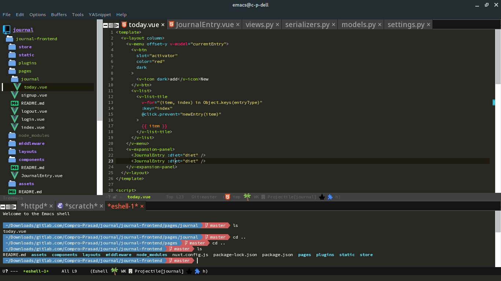
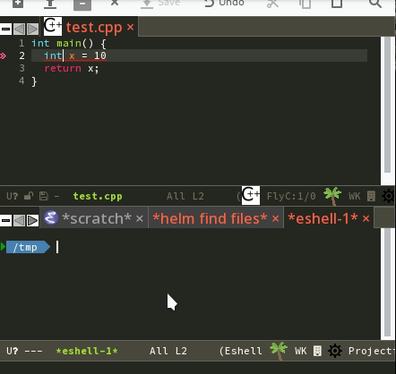

Simple Emacs for Simple Users
---

# Introduction

GNU Emacs is a beast that cannot be tamed easily. So, I have tried to convert
this beast into a puppy that you will love using. If the puppy gets harsh on you
then open an [issue](https://github.com/Compro-Prasad/simple-emacs/issues) or
send a [pull request](https://github.com/Compro-Prasad/simple-emacs/pulls) so
that we can work towards a better simple Emacs.

# Quick Jump

- [Install development version of Emacs](#requirements)
- [Install simple-emacs](#installing-simple-emacs)
- [Keybinding conventions](#some-keybinding-conventions)
- [Different features](#c-g-the-panic-key)

# Target users

This configuration is targeted towards new users who have been using modern
editors like Sublime Text and want to see the power of Emacs.

# Why should I switch?

- This configuration of Emacs ensures that anybody can dive into with zero
  configurations provided you have latest Emacs and this configuration.
- If you feel anything is missing then digging deep is very easy with high
  quality documentation from right within the editor itself.
- Huge technical help is available once you get to know the basics about Emacs
  and Elisp.
- You come to learn lots of things by just knowing the internals of Emacs.

# Why should I not switch?

- This is a beta configuration and forever will be in beta. If you don't have time
  to check out this configuration and report bugs, features and keybindings then
  it is not for you.
- Smooth scrolling isn't there.
- The point(cursor) moves as you scroll the buffer. Workaround is to press
  `C-SPC` twice before scrolling. To go back to the position, use `C-x` twice.
- No minimap.
- Ligature support is missing. Ligature support is there but there are a few
  technical difficulties related to indentation when writing Lisp code or
  multiline statements in a language like C++. Else, it works 100% fine. Its not
  included with this configuration so you don't need to worry about it.
- Tabs in the GUI may vanish in some modes. To switch to a buffer you can still
  use either of `C-x C-<left>`, `C-x C-<right>`, `C-<tab>`, `C-S-<tab>`, `C-x
  b`. See [keybinding conventions](#some-keybinding-conventions).

# Requirements

This has been tested on GNU Emacs development build on Linux. Other stable
versions of Emacs which are normally available through an app store will not
work with this configuration.

The best option I recommend is to compile Emacs from source from
https://git.sv.gnu.org/emacs.git but that might be hard for newbies. So, there
are alternate options to install the latest builds.

For Ubuntu:

    sudo add-apt-repository ppa:ubuntu-elisp/ppa
    sudo apt-key adv --keyserver keyserver.ubuntu.com --recv-keys 0D7BAE435ADBC6C3E4918A74062D648FD62FCE72
    sudo apt-get update
    sudo apt-get install emacs-snapshot

If the public key has changed then you can use the fingerprint from
[here](https://launchpad.net/~ubuntu-elisp/+archive/ubuntu/ppa#signing-key).

For Arch Linux:

    pacaur -S emacs-git

For macOS:

    brew install emacs-mac --with-cocoa --with-xml2 --with-gnutls --with-imagemagick --with-glib --HEAD

# Installing `simple-emacs`

If you have been using Emacs from before then backup your configurations:

    mv ~/.emacs.d ~/.emacs.d.bak
    mv ~/.emacs ~/.emacs.bak

Clone the `simple-emacs` repository using git:

    git clone https://github.com/Compro-Prasad/simple-emacs.git ~/.emacs.d

Now open Emacs and start doing your stuff.

# Some keybinding conventions

- `F9 s` → Press and leave `F9` then press and leave `S`
- `C-x b` → Press and hold `Ctrl` then press `X`. Leave the keys. Then press `B`.
- `C-x` → Ctrl + X
- `M-x` → Alt + X
- `C-S-x` → Ctrl + Shift + X
- `C-M-x` → Ctrl + Alt + X
- `M-S-x` → Alt + Shift + x
- Keybindings are case sensitive, i.e., `C-t` and `C-S-t` are different keys. Or
  `C-x b` and `C-x B` are also different.
- This configuration has changed many default keybindings. Trying to run these
  keys on a different configuration would result in a totally different outcome.
- General keybinding conventions in Emacs can be found
  [here](https://www.gnu.org/software/emacs/manual/html_node/elisp/Key-Binding-Conventions.html)
  and
  [there](https://www.masteringemacs.org/article/mastering-key-bindings-emacs).

# `C-g` the Panic key

When you think you pressed the wrong key or Emacs isn't responding then you can
press `C-g` to cancel any action.

If that doesn't help then do `ESC` or `C-]` or `C-x X q` or `M-x top-level`.

# Files

- Press `C-n` to create an unsaved buffer. Use `C-s` to save it else it will be
  lost in the next session.
- Press `C-o` to open or create a file.
- Use native `C-x C-f` to do any of the above but using Ivy interface.

# Projects

- **File > Open project** opens project in sidebar.
- Clicking on extreme left of the window toggles sidebar. Shortcut is `C-b`.
- `C-p @` - find a string in current project.
- `C-p &` - Run a shell command from project root.
- `C-p c` - Compile and run current project(accepts a command).
- `C-p b` - List buffers in current project.
- `C-p r` - Replace a string in whole project.
- `C-p :` - Goto line number in current buffer.

# Tabs and Buffers

Buffers are internal representations of tabs in Emacs. In other words, tabs are
a secondary representation of an Emacs buffer.

## Navigating

- You can switch between tabs using `C-TAB` and `C-S-TAB`.
- To switch between recently used buffers, use `C-x C-right` and `C-x C-left`.
- `C-x b` lists all buffers in current session. Select one to open.
- `C-p b` lists all buffers in current open project.
- Tabs are grouped by projects. Use `-` in top left corner to switch projects.

## Closing

- Closing a tab is analogous to closing a buffer.
- `C-w` or `C-x k` to close any tab.
- `C-f4` to close current tab.

# Multiple cursors

Work in progress.

| Keybind     | Definition                |
|-------------|---------------------------|
| `C-d`       | Select next occurance     |
| `C-S-d`     | Select previous occurance |
| `C-;`       | Select all occurances     |
| `M-S-click` | Create cursor with mouse  |

# Undo and Redo

- To undo a change press `C-z`.
- To redo changes press `C-S-z`.
- If the undo/redo is confusing you then press `C-/` to visualize undo tree. Use
  `up`/`down` to navigate history or `q` to close the tree.
- Undo history is saved throughout sessions.

# Searching

When searching for a query, all the results are grouped in the minibuffer
itself. Pressing return on any of them takes you to that place.

- `C-f` searchs in the current buffer
- `C-r` searches in a Git project. If it is not a Git repository then directory
  is asked first. For it to work in absence of git project install
  [the_silver_searcher](https://github.com/ggreer/the_silver_searcher):

Ubuntu:

    sudo apt install silversearcher-ag

Arch Linux:

    sudo pacman -S the_silver_searcher

# Shell

- Pop up, switch or close shell using `C-'`
- There are three shells in Emacs: `shell`, `eshell` and `term`
- Default shell is `eshell`
- Use `C-l` to clear eshell buffer
- In Eshell, type use-theme to list and preview available themes
- To customize shell behaviour look into `simple-shell.el`

# Preview HTML pages

When you open an HTML file in Emacs you can see its live preview by going to
<http://localhost:8080/imp/>.

# Python

To make Emacs a Python IDE, you need to have anaconda_mode installed:

    sudo pip2 install anaconda_mode   # For python2
    sudo pip3 install anaconda_mode   # For python3

This will enable syntax checking and symbol completion for python files.

-   Find definitions using `M-.`
-   Find assignments using `M-*`
-   Find references using `M-r`
-   Jump back to previous location using `M-,`
-   Activate virtual environment using `M-x pyvenv-activate`. Enter root directory
    of the virtual environment as input.
-   If you are using `pipenv` then you can easily do `M-x pipenv-activate`.

See [official
repository](https://github.com/proofit404/anaconda-mode#interactive-commands)
for more information on keybindings for jumping to definitions and stuff.

# Toggling features
| Keybinding | Feature                | Function                 |
|------------|------------------------|--------------------------|
| `C-t m`    | Menu bar               | `menu-bar-mode`          |
| `C-t t`    | Tool bar               | `tool-bar-mode`          |
| `C-t l`    | Line numbers           | `linum-mode`             |
| `C-t s`    | Syntax checking        | `flycheck-mode`          |
| `C-t c`    | Completion             | `company-mode`           |
| `C-t T`    | Tabs                   | `tabbar-mode`            |
| `C-t i`    | Aggressive indentation | `aggressive-indent-mode` |

See [ChangleLog](CHANGELOG.md) for further bits of technical details as per
release.
